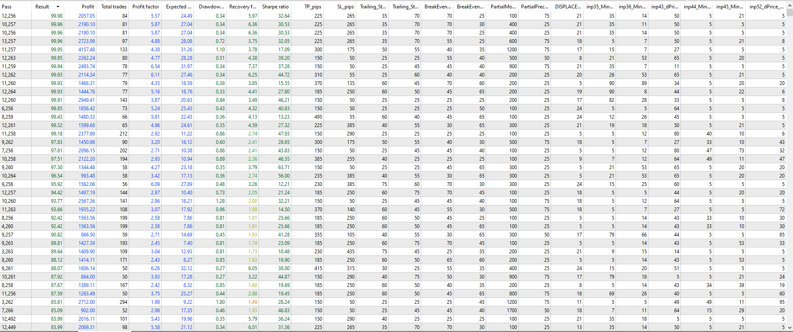
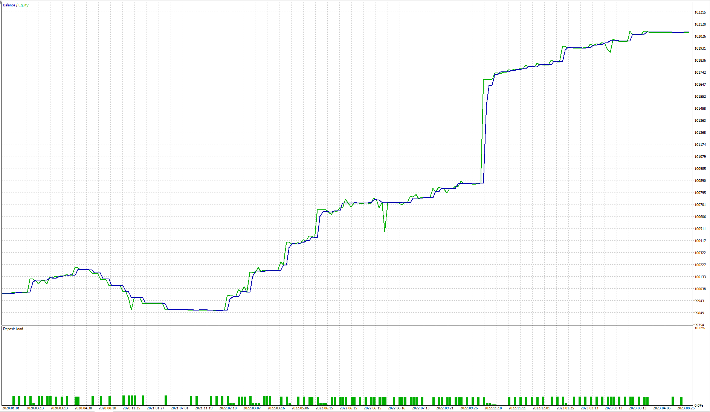
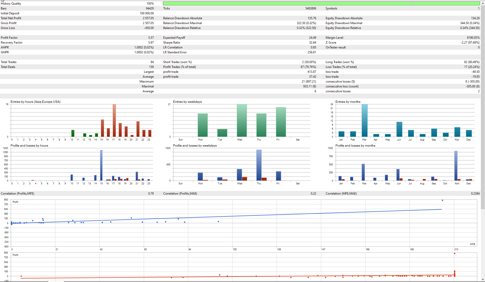
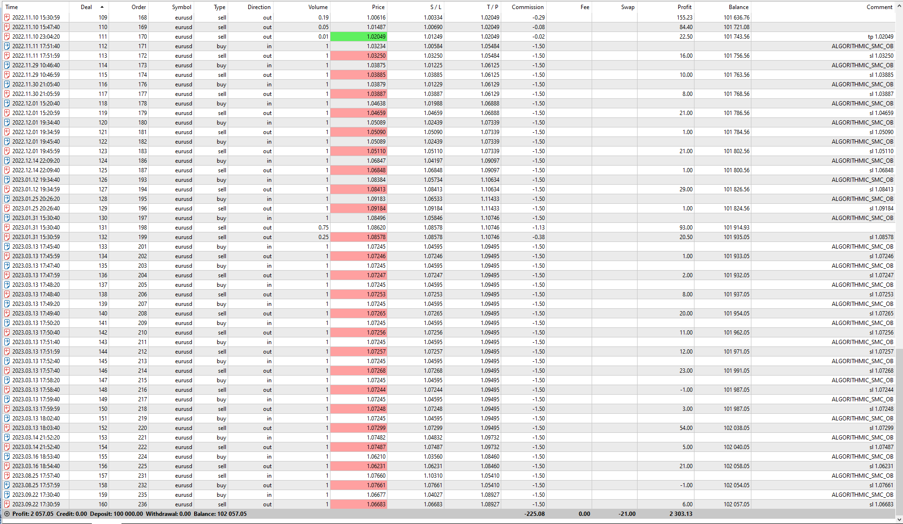
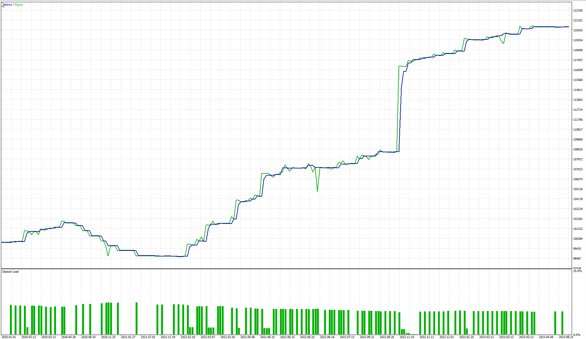
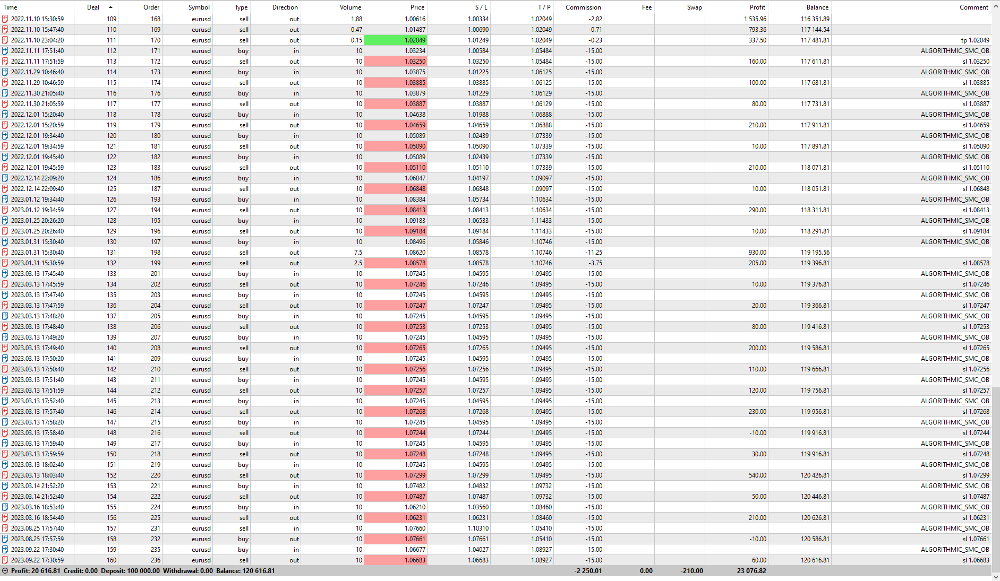

### GENETIC ALGORITHM OPTIMIZATION GAO
#### OPTIMIZATION STANDARDIZATION ON CONFIG SETUP INPUTS
 - **TIMEFRAME** - M15
 - **Data Modeling** - M1 OHLC
 - **DATES** - 01.01.2020 TO 15.10.2023 (LAST 3 YEARS)
 - **OPTIMIZATION CRITERION**: FBGAO - Fast Based Genetic Algorithm + Complex Criterion Max
 - **LOTS**: 1, 10 and 100 (3 tests at 99.99 score on the optimizer)
 - **ACCOUNT SIZE**: 100,000.00 USD
 - **LEVERAGE**: 1:100

#### OPTIMIZATION RESULTS SCORE

#### OPTIMIZATION FROM 2020 JAN TO 2023 OCT

### RESULTS FOR 1 LOT (LOW RISK)
##### INPUT VARIABLES CHANGE AS A X10 MULTIPLE AS FOLLOWS

##### GRAPH REPORT

##### BACKTEST REPORT

##### DEALS REPORT (TRADES)

[DEALS 1 LOT REPORT XLS - ](REPORTS/ReportTester-1051916509-1LOT.100.USD.PARTIALS.xlsx)

##### CONFIG TO USE
<OPTIMIZED CONFIG SET FILE/INPUT_SETTINGS_GA_99.x.SCORE.M15.EURUSD.SMC.OB.1.6.1.2_1.LOT.100.USD.PARTIALS.set>

### RESULTS FOR 10 LOT (MID RISK)
##### INPUT VARIABLES CHANGE AS A X10 MULTIPLE AS FOLLOWS

##### GRAPH REPORT

##### BACKTEST REPORT

##### DEALS REPORT (TRADES)

[DEALS 10 LOT REPORT XLS - ](REPORTS/ReportTester-1051916509-10LOT.1000.USD.PARTIALS.xlsx)

##### CONFIG TO USE
<OPTIMIZED CONFIG SET FILE/INPUT_SETTINGS_GA_99.x.SCORE.M15.EURUSD.SMC.OB.1.6.1.2_10.LOT.1000.USD.PARTIALS.set>