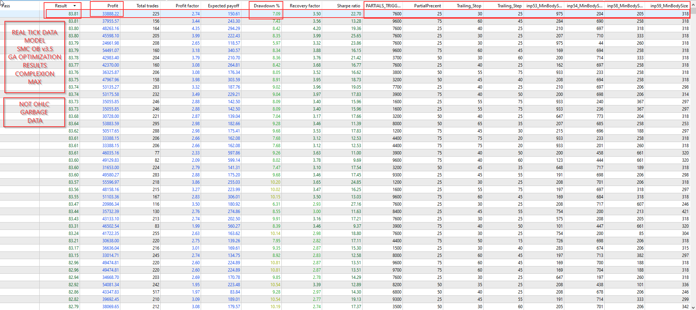
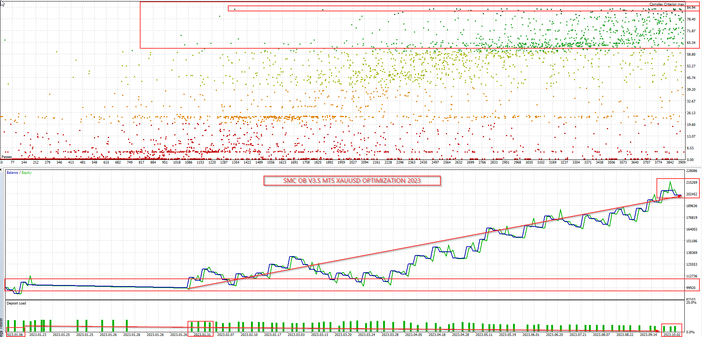
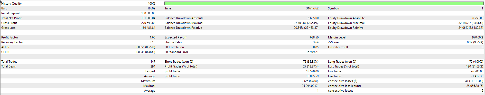
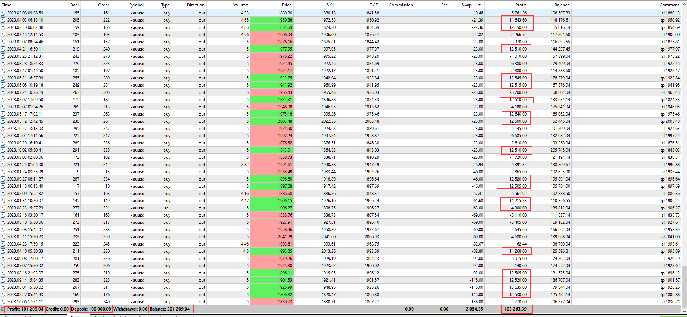

### GENETIC ALGORITHM OPTIMIZATION GAO
#### OPTIMIZATION STANDARDIZATION ON CONFIG SETUP INPUTS
 - **TIMEFRAME** - M15
 - **Data Modeling** - Real Tick Data Model
 - **DATES** - 01.01.2023 TO 15.10.2023 (LAST 1 Year +/-)
 - **OPTIMIZATION CRITERION**: FBGAO - Fast Based Genetic Algorithm + Complex Criterion Max
 - **LOTS**: Risk used was 0.5% of the balance or 500 USD
 - **ACCOUNT SIZE**: 100,000.00 USD
 - **LEVERAGE**: 1:100

#### OPTIMIZATION XAUUSD FROM 2023 JAN TO 2023 OCT

### RESULTS FOR 0.5% RISK - 103,26% PROFIT (103,263.00) - 24,06% MAX DRAWDOWN IN LESS THAN 1 YEAR BACKTEST

##### GRAPH REPORT

##### BACKTEST REPORT

##### DEALS REPORT (TRADES)

##### CONFIG TO USE
Algorithmic/GENETIC ALGORITHM OPTIMIZATION/SMC ORDER BLOCKS/SMC ORDER BLOCKS 3.5/XAUUSD/SMC_OB_3.5_XAU_M15_60.71.SCORE_OPTIMIZER.set

