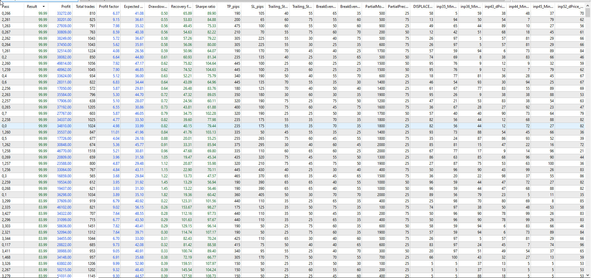
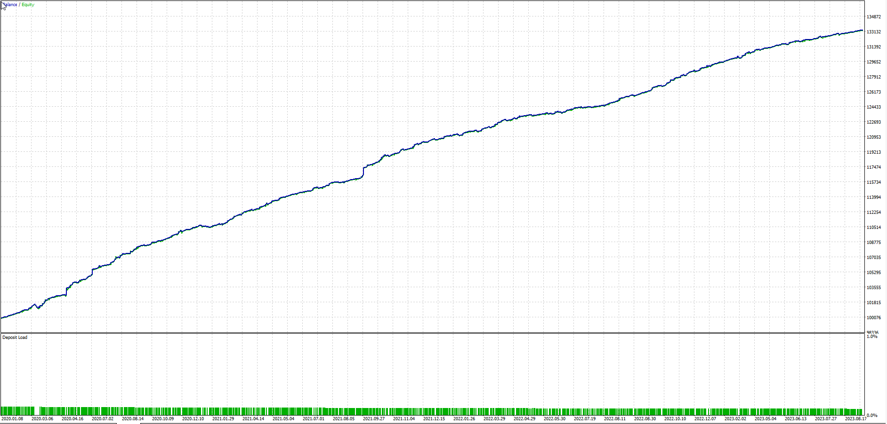
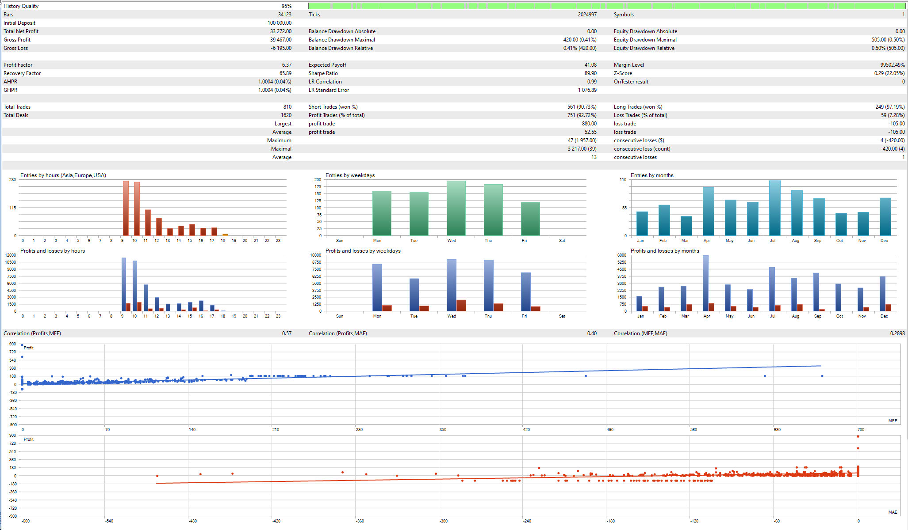
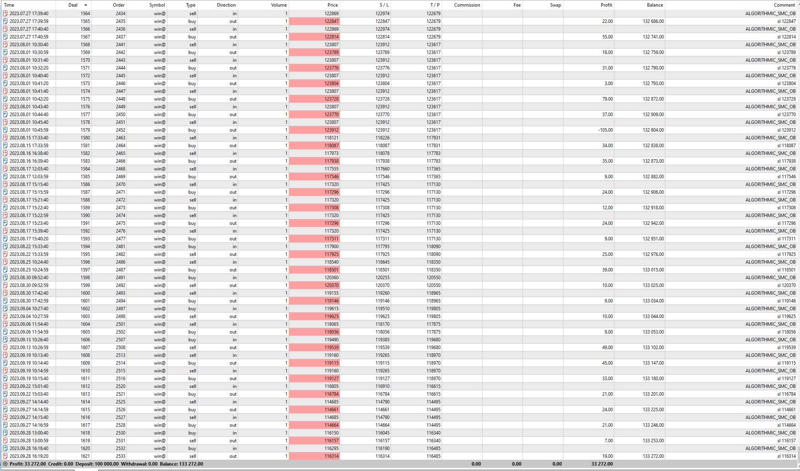
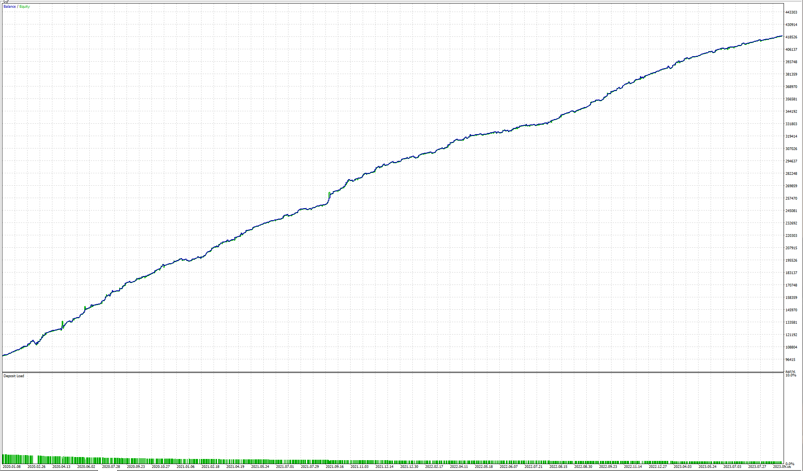
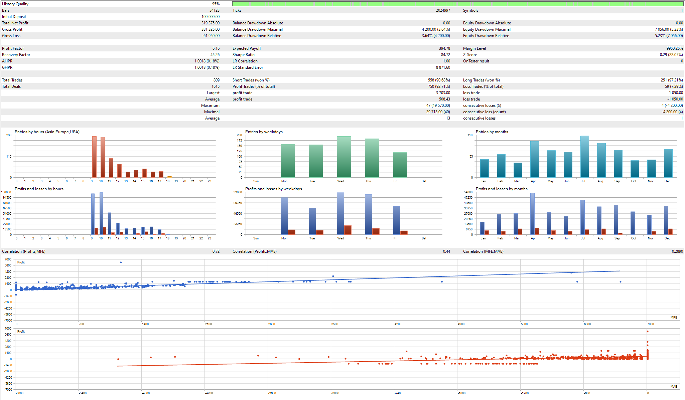
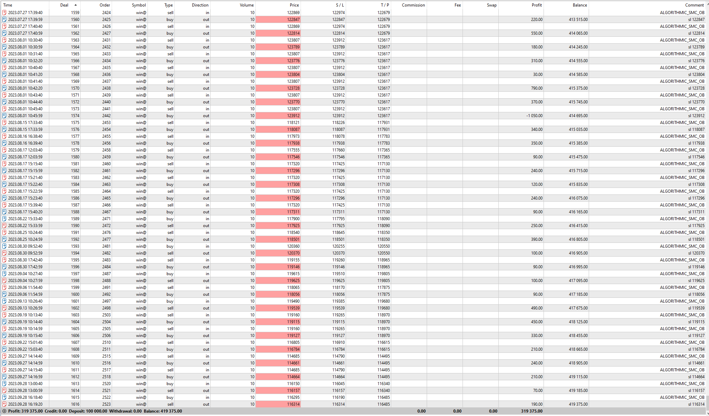
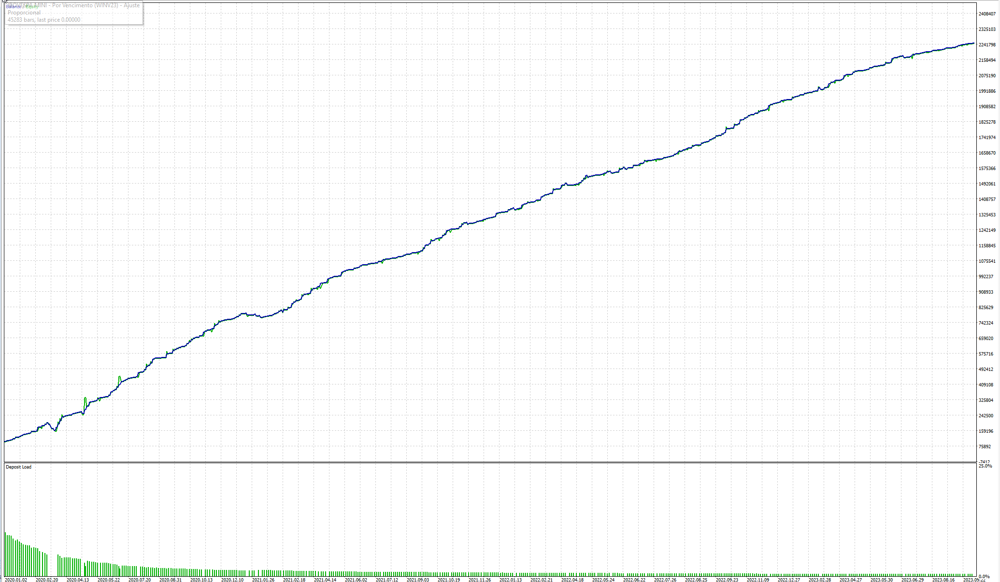
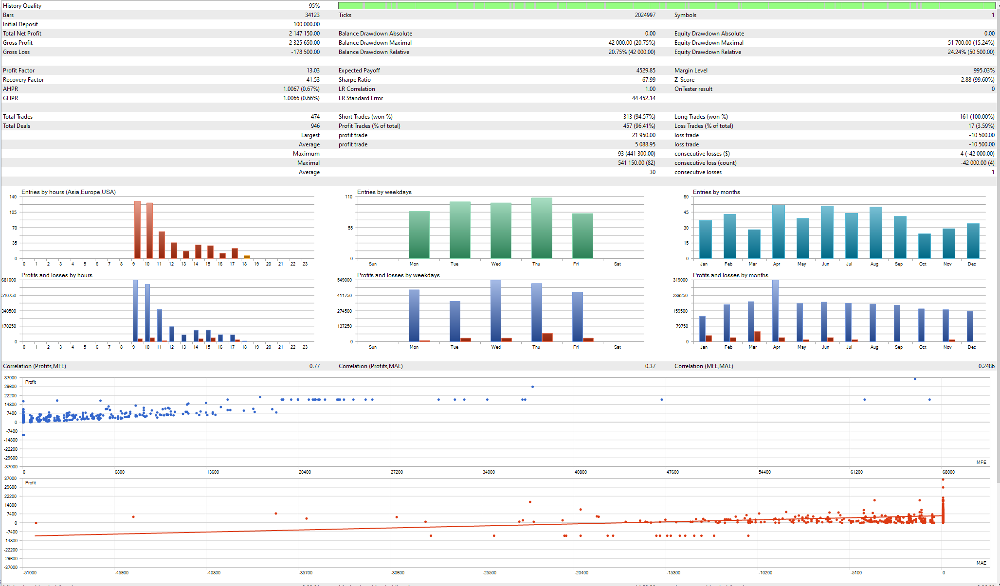

### GENETIC ALGORITHM OPTIMIZATION GAO
#### OPTIMIZATION STANDARDIZATION ON CONFIG SETUP INPUTS
 - **TIMEFRAME** - M15
 - **Data Modeling** -M1 OHLC
 - **DATES** - 01.01.2020 TO 15.10.2023 (LAST 3 YEARS)
 - **OPTIMIZATION CRITERION**: FBGAO - Fast Based Genetic Algorithm + Complex Criterion Max
 - **LOTS**: 1, 10 and 100 (3 tests at 99.99 score on the optimizer)
 - **ACCOUNT SIZE**: 100,000.00 USD
 - **LEVERAGE**: 1:100

#### OPTIMIZATION RESULTS SCORE

#### OPTIMIZATION WIN@ FROM 2020 JAN TO 2023 OCT

### RESULTS FOR 1 LOT (LOW RISK) - 33,27% PROFIT (33,272.00) - 0,50% MAX DRAWDOWN IN 3 YEARS BACKTEST
##### INPUT VARIABLES CHANGE AS A X10 MULTIPLE AS FOLLOWS

##### GRAPH REPORT

##### BACKTEST REPORT

##### DEALS REPORT (TRADES)

[DEALS 1 LOT REPORT XLS](REPORTS/DEALS.ReportTester-513542500.1.LOT.500USD.PARTIALS.xlsx)

##### CONFIG TO USE
<OPTIMIZED CONFIG SET FILE/INPUT_SETTINGS_GA_99.99.SCORE.M15.WIN@.SMC.OB.1.6.1.2_1.LOT.500.USD.PARTIALS.set>

### RESULTS FOR 10 LOT (MID RISK) - 319,37% PROFIT (319,375.00)- 5,23% MAX DRAWDOWN IN 3 YEARS BACKTEST
##### INPUT VARIABLES CHANGE AS A X10 MULTIPLE AS FOLLOWS

##### GRAPH REPORT

##### BACKTEST REPORT

##### DEALS REPORT (TRADES)

[DEALS 10 LOT REPORT XLS](REPORTS/DEALS.ReportTester-513542500.10.LOT.5000USD.PARTIALS.xlsx)

##### CONFIG TO USE
<OPTIMIZED CONFIG SET FILE/INPUT_SETTINGS_GA_99.99.SCORE.M15.WIN@.SMC.OB.1.6.1.2_10.LOT.5000.USD.PARTIALS.set>

### RESULTS FOR 100 LOT (HIGH RISK) - 2,147% PROFIT (2,147.150.00) - 15,24% MAX DRAWDOWN IN 3 YEARS BACKTEST
##### INPUT VARIABLES CHANGE AS A X10 MULTIPLE AS FOLLOWS

##### GRAPH REPORT

##### BACKTEST REPORT

##### DEALS REPORT (TRADES)

[DEALS 100 LOT REPORT XLS ](REPORTS/DEALS.ReportTester-513542500.100.LOT.50000USD.PARTIALS.xlsx)

##### CONFIG TO USE
<OPTIMIZED CONFIG SET FILE/INPUT_SETTINGS_GA_99.99.SCORE.M15.WIN@.SMC.OB.1.6.1.2_100.LOT.50000.USD.PARTIALS.set>